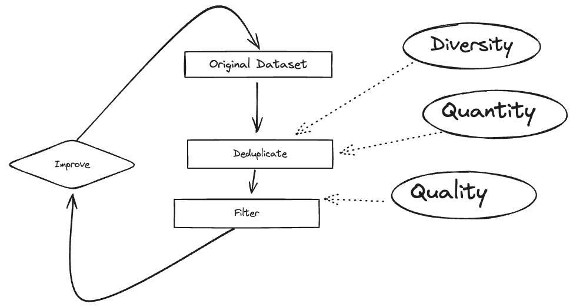

# Datasets for fine-tuning LLMs

This repo is to accompany a session run as part of the Mastering LLMs: A Conference For Developers & Data Scientists conference. The session focused on _some_ of the data issues related to fine-tuning LLMs.

The goals of the notebooks are focused on balancing the requirement to have sufficiently diverse data, with high quality and the right quantity i.e. avoid duplication.

## Notebooks

- [01_eda_and_deduplication](01_eda_and_deduplication.ipynb)
- [02-data-checks](02-data-checks.ipynb)
- [03-synthetic-data-generation](03-synthetic-data-generation.ipynb)

## Synthetic data pipelines

- [dataset-card-summaries](dataset-card-summaries/): This folder contains a pipeline for generating a synthetic dataset focused on generating tl;dr summaries of datasets based on their dataset card.

### Other resources for synthetic data generation

- [awesome-synthetic-datasets](https://github.com/davanstrien/awesome-synthetic-datasets)
